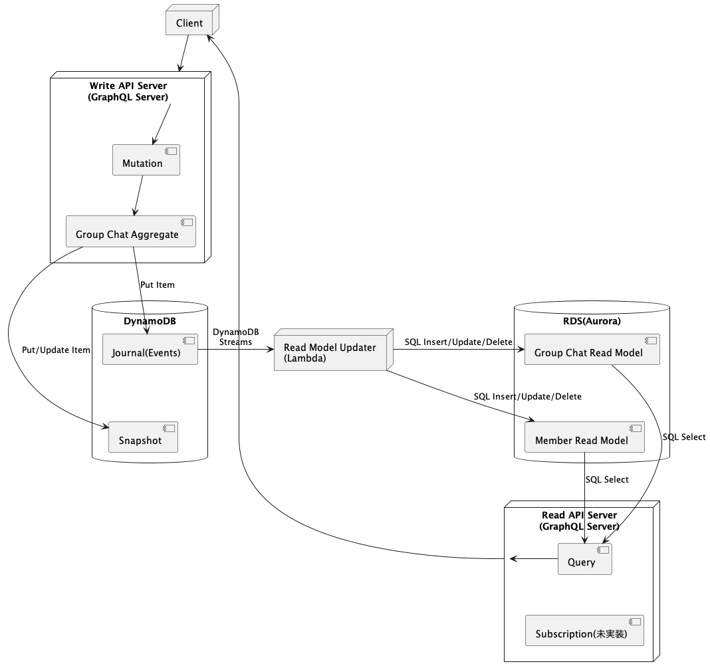

# cqrs-es-example-java

## Overview

Status: In Implementation

This is an example of CQRS/Event Sourcing and GraphQL implemented in Java.

This project uses [j5ik2o/event-store-adapter-java](https://github.com/j5ik2o/event-store-adapter-java) for Event Sourcing.

Please refer to [here](https://github.com/j5ik2o/cqrs-es-example) for implementation examples in other languages.

[日本語](./README.ja.md)

## Feature

- [ ] Write API Server(GraphQL)
- [ ] Read API Server(GraphQL)
- [ ] Read Model Updater on Local
- [ ] Docker Compose Support
- [ ] Read Model Updater on AWS Lambda
- [ ] Deployment to AWS

## Overview

### Component Composition

- Write API Server
  - API is implemented by GraphQL (Mutation)
  - Event Sourced Aggregate is implemented by [j5ik2o/event-store-adapter-java](https://github.com/j5ik2o/event-store-adapter-java)
- Read Model Updater
  - Lambda to build read models based on journals
  - Locally, run code that emulates Lambda behavior (local-rmu)
- Read API Server
  - API is implemented by GraphQL (Query)

### System Architecture Diagram

## Links

- [Common Documents](https://github.com/j5ik2o/cqrs-es-example)
